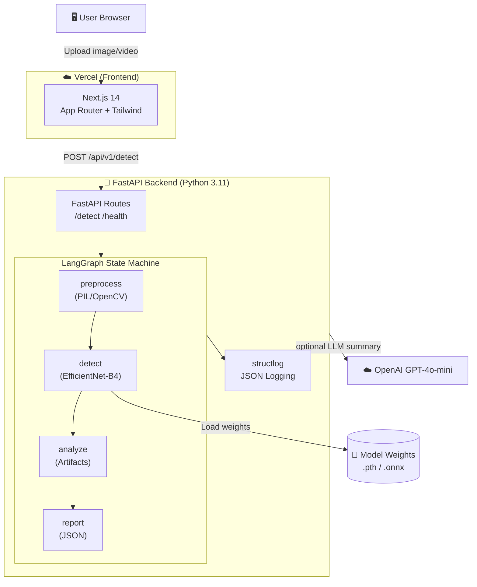

# Deepfake Agentic AI — Architecture

## System Overview

```
┌─────────────────────────────────────────────────────────────────────┐
│                        User (Browser)                               │
│              Next.js App Router — Vercel Deploy                     │
└───────────────────────────┬─────────────────────────────────────────┘
                            │  HTTPS / REST
                            ▼
┌─────────────────────────────────────────────────────────────────────┐
│                    FastAPI Backend (Python)                          │
│   POST /api/v1/detect   ←── multipart/form-data (image/video)       │
│                                                                     │
│  ┌─────────────────── LangGraph Agent ────────────────────────┐    │
│  │                                                             │    │
│  │  [preprocess] → [detect] → [analyze] → [report]            │    │
│  │       ↓              ↓           ↓            ↓             │    │
│  │  PIL/OpenCV    EfficientNet   Heuristic   Structured        │    │
│  │   decode       / ViT-B/16    Artifacts    JSON Report       │    │
│  └─────────────────────────────────────────────────────────────┘    │
│                                                                     │
│  ┌──────────────────────────────────────────────────────────────┐   │
│  │  Structured Logging (structlog) → stdout / cloud aggregator  │   │
│  └──────────────────────────────────────────────────────────────┘   │
└─────────────────────────────────────────────────────────────────────┘
```

## Component Map



## Data Flow

1. **User uploads** image or video frame via the Next.js UI
2. **FastAPI** validates the file type, hashes the content (SHA-256), assigns a `request_id`
3. **LangGraph graph** is invoked:
   - `preprocess`: decodes bytes → PIL Image → numpy float32 array (224×224)
   - `detect`: runs the EfficientNet-B4 (or ViT) model → softmax score [0,1]
   - `analyze`: extracts visual artifacts (frequency domain, texture, blending seams)
   - `report`: constructs the final structured `DetectionResult`
4. **Response** is returned as JSON with: `is_deepfake`, `confidence`, `label`, `artifacts`, `agent_summary`
5. **Frontend** renders the result on the `/results` page with visual charts

## Directory Structure

```
Deepfake_Agentic_AI/
├── backend/               ← Python FastAPI + LangGraph
│   ├── main.py            ← App entry point
│   ├── requirements.txt
│   ├── .env.example
│   └── app/
│       ├── api/routes.py  ← REST endpoints
│       ├── agent/graph.py ← LangGraph detection pipeline
│       ├── models/        ← Detector class (EfficientNet / ViT)
│       ├── utils/         ← Logging, helpers
│       └── core/config.py ← Settings (pydantic-settings)
│
├── frontend/              ← Next.js 14 App Router (Vercel)
│   ├── app/               ← Pages & layouts
│   ├── components/        ← Reusable UI components
│   └── lib/               ← API client, utilities
│
├── data/
│   ├── samples/real/      ← Committed test samples
│   ├── samples/fake/      ← Committed test samples
│   └── raw/               ← GITIGNORED — download via scripts
│
├── docs/                  ← Architecture, evaluation charts
├── scripts/               ← Dataset download, eval, synthetic gen
└── .gitignore
```

## Tech Stack

| Layer | Technology | Reason |
|---|---|---|
| Frontend | Next.js 14 (App Router) | Vercel-native, RSC, streaming |
| Styling | Tailwind CSS | Utility-first, fast iteration |
| Backend | FastAPI + uvicorn | Async, fast, auto-docs |
| Agent | LangGraph + LangChain | Stateful multi-step pipelines |
| Detection | EfficientNet-B4 / ViT-B/16 | SOTA on FF++ benchmark |
| CV | OpenCV + Pillow | Frame extraction & preprocessing |
| Logging | structlog | Machine-readable JSON logs |
| Deployment | Vercel (FE) + any PaaS (BE) | Simple, scalable |

## Evaluation Metrics

- **AUC-ROC** — primary ranking metric
- **Accuracy** @ 0.5 threshold
- **F1 Score** — for imbalanced test sets
- **EER** (Equal Error Rate) — for security-critical thresholds
- **Inference latency** (ms / frame) — operational constraint
